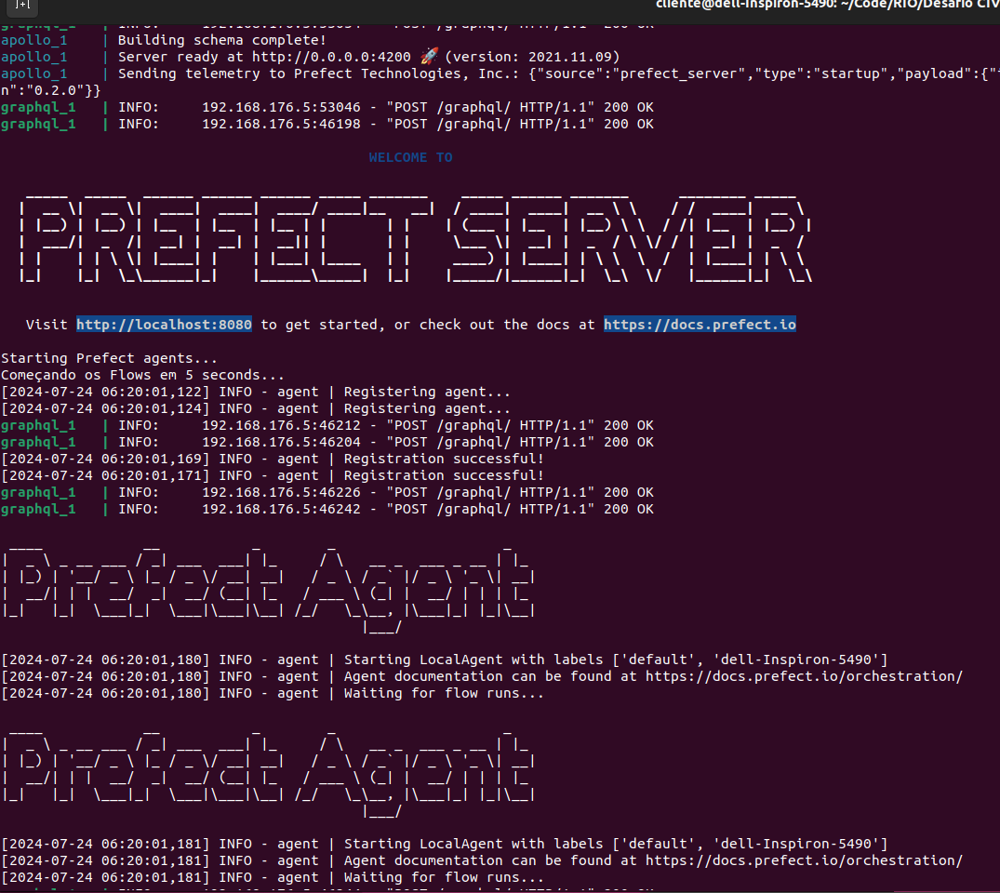
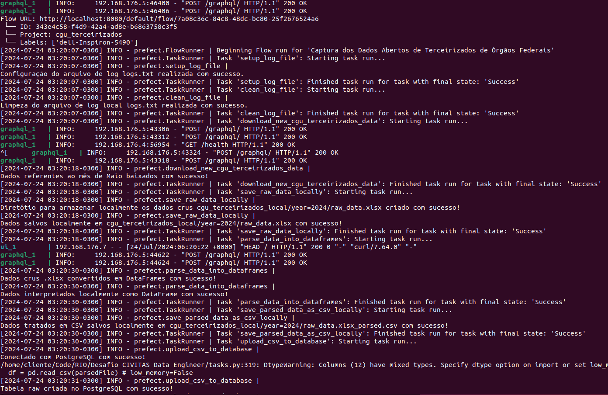
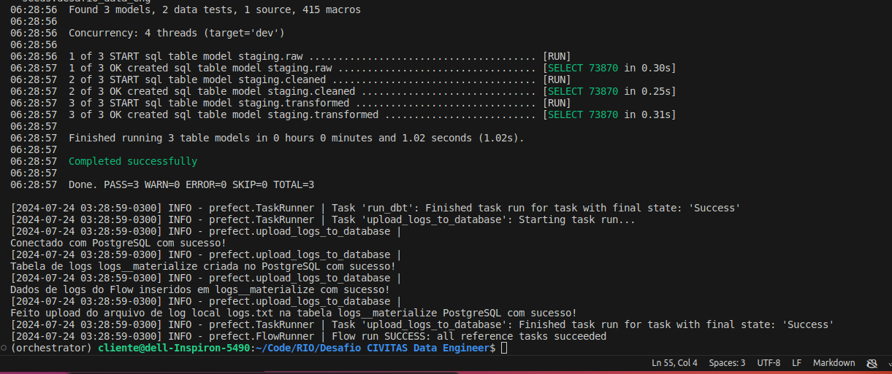
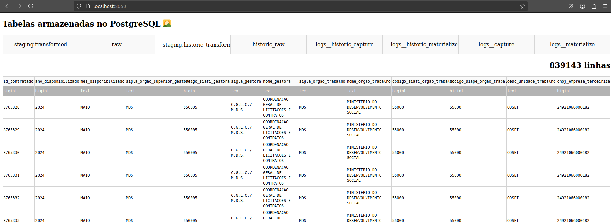

# Desafio Engenheiro de Dados @ Escritório de Dados
# Capture e Materialize os Dados Abertos de Terceirizados de Órgãos Federais

1. :
   ```sh
   python -m venv orchestrator
   ```
2. :
   ```sh
   source orchestrator/bin/activate
   ```
3. :
   ```sh
   pip install -r requirements.txt
   ```

### Opção 1:
1. :
   ```sh
   chmod +x start.sh
   ```
2. :
   ```sh
   ./start.sh
   ```
<!--  -->

3. :
   Visite [http://localhost:8080/](http://localhost:8080/) no seu browser para acompanhar os Flows.

### Opção 2:
1. :
   ```sh
   prefect server start
   ```
Em outra janela do terminal:

2. : 
   ```sh
   prefect agent local start --label default
   ```
Em outra janela do terminal:

3. :
   ```sh
   prefect create project cgu_terceirizados
   ```
4. :
   ```sh
   python ./capture.py
   ```
   ```sh
   python ./materialize.py
   ```
   ```sh
   python ./run.py
   ```
<!-- 
 -->

### Para visualizar os dados após Captura e Materialização

Com o Servidor Prefect local rodando:

1. :
   ```sh
   pip install -r requirements__view_results.txt
   ```
2. :
   ```sh
    python ./view_results.py
   ```
3. :
   Visite [http://localhost:8050/](http://localhost:8050/) no seu browser.
<!--  -->

### Para parar o Servidor e Agente Prefect

1. :
   ```sh
   prefect server stop
   ```
2. : 
   ```sh
   pkill -f 'prefect agent local start'
   ```
ou:

1. :
   ```sh
   chmod +x stop.sh
   ```
2. :
   ```sh
   ./stop.sh
   ```
### Conectar diretamente ao PostgreSQL:
1. :
   ```sh
   prefect server stop
   ```
2. : 
   ```sh
   docker exec -it $(docker ps | grep 'postgres:11' | awk '{print $1}') bash
   ```
3. :
   ```sh
   psql -U prefect -d prefect_server -W
   ```
4. :
Escreva a senha: "test-password"

## 
caso:
```sh
   (orchestrator) user@machine:~/path$ ./start.sh
   Pulling postgres ... done
   Pulling hasura   ... done
   Pulling graphql  ... done
   Pulling apollo   ... done
   Pulling towel    ... done
   Pulling ui       ... done
   Starting tmp_postgres_1 ... error

   ERROR: for tmp_postgres_1  Cannot start service postgres: network $ID not found

   ERROR: for postgres  Cannot start service postgres: network $ID not found
   ERROR: Encountered errors while bringing up the project.
   ```
1. :
   ```sh
   docker network prune -f
   ```

Caso ainda esteja com o mesmo erro, utilize o script que finaliza todos os processos relacionados com a pipeline:
1. :
   ```sh
   chmod +x clean.sh
   ```
2. :
   ```sh
   ./clean.sh
   ```

by Filipe