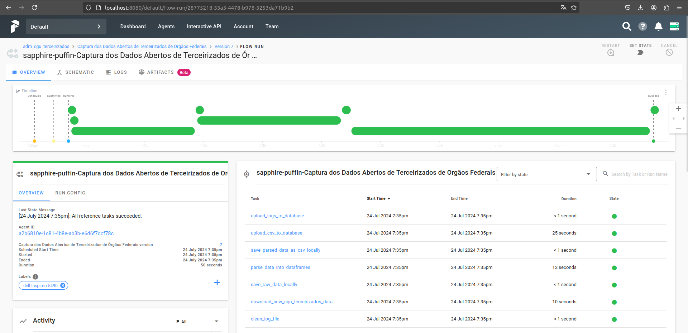

<!-- # Desafio Engenheiro de Dados @ Escritório de Dados -->
# Capture e Materialize os Dados Abertos de Terceirizados de Órgãos Federais

### Flow de Captura de Dados
**SETUP**:
(🔧) Configurar Arquivo de Log -> (🧹) Limpar Arquivo de Log ->

**EXTRACT**:
 -> (⬇️) Baixar Dados -> (💾) Salvar Dados Brutos Localmente ->

**CLEAN**:
 -> (🔍) Interpretar Dados em DataFrames -> (📝) Salvar Dados como CSVs Localmente ->

**LOAD**:
 -> (⬆️) Carregar CSVs para o Banco de Dados -> (⬆️) Carregar Logs para o Banco de Dados

### Flow de Materialização dos Dados

**SETUP**:
    (🔧) Configurar Arquivo de Log -> (🧹) Limpar Arquivo de Log  ->

**TRANSFORM (DBT)**:
    -> (📦) staging.raw (Dados Brutos) -> (🧼) staging.cleaned (Dados com valor nulo padrão) -> 
    (📝) staging.renamed (Colunas renomeadas seguindo manuais de estilo do [Escritório de Dados](https://docs.dados.rio/guia-desenvolvedores/manual-estilo/#nome-e-ordem-das-colunas) e [Base dos Dados](https://basedosdados.github.io/mais/style_data/)) -> (🔧) staging.transformed (Colunas com tipos definidos.) ->

**LOAD**:
    -> (⬆️) Carregar CSV para o Banco de Dados -> (⬆️) Carregar Logs para o Banco de Dados

---
## Execute:

Configure ambiente virtual python, variáveis de ambiente necessárias, e baixe os requerimentos do sistema:

0. :
   ```sh
   python -m venv orchestrator && source orchestrator/bin/activate && cp .env.example .env && pip install -r requirements/start.txt
   ```

Execute o Servidor Prefect:

1. :
   ```sh
   prefect server start
   ```

espere até a arte em ASCII:
```sh
                                         WELCOME TO

_____  _____  ______ ______ ______ _____ _______    _____ ______ _______      ________ _____
|  __ \|  __ \|  ____|  ____|  ____/ ____|__   __|  / ____|  ____|  __ \ \    / /  ____|  __ \
| |__) | |__) | |__  | |__  | |__ | |       | |    | (___ | |__  | |__) \ \  / /| |__  | |__) |
|  ___/|  _  /|  __| |  __| |  __|| |       | |     \___ \|  __| |  _  / \ \/ / |  __| |  _  /
| |    | | \ \| |____| |    | |___| |____   | |     ____) | |____| | \ \  \  /  | |____| | \ \
|_|    |_|  \_\______|_|    |______\_____|  |_|    |_____/|______|_|  \_\  \/   |______|_|  \_\

Visit http://localhost:8080 to get started
```

Em outro terminal:

2. :
   ```sh
   source orchestrator/bin/activate && prefect create project adm_cgu_terceirizados && python ./run/capture.py && python ./run/materialize.py && python ./run/historic_capture.py && python ./run/historic_materialize.py
   ```

Em um terceiro terminal:

3. :
   ```sh
   source orchestrator/bin/activate && pip install -r requirements/results.txt && python ./run/results.py
   ```

### App Dash (localhost:8050) para visualizar tabelas do PostgreSQL


### Para programar Schedule (Cronograma) de Captura

1. :
   ```sh
   source orchestrator/bin/activate && python ./run/scheduler.py
   ```

### Dashboard Prefect (localhost:8080) para acompanhar Scheduler e Flows



#### Ou então, rode o Bash Script:

Permita execução dos scripts:

0. :
   ```sh
   sudo chmod +x start.sh scripts/stop.sh && scripts/stop.sh
   ```
Execute:

1. :
   ```sh
   script/start.sh
   ```

#### Para parar o Servidor e Agente(s) Prefect

0. :
   ```sh
   sudo chmod +x scripts/stop.sh
   ```

1. :
   ```sh
   ./scripts/stop.sh
   ```

ambos podem ser executados para capturar/materializar todos os dados históricos disponíveis no [Portal de Dados Abertos - Terceirizados de Órgãos Federais](https://www.gov.br/cgu/pt-br/acesso-a-informacao/dados-abertos/arquivos/terceirizados), ou apenas o mais recente disponível.

### Conectar diretamente ao PostgreSQL:

Na camada com o Servidor Prefect em execução:

1. : 
   ```
   docker exec -it $(docker ps | grep 'postgres:11' | awk '{print $1}') bash
   ```
2. :
   ```sh
   psql -U prefect -d prefect_server -W
   ```
3. :
Escreva a senha: "test-password"

#### Opção Futura: Rode dentro de um container Docker (WIP)

🚫 Sobe os serviços, porém servidor Prefect não fica disponível. Debuggando 🚧
Permita execução dos scripts necessários e configuração docker:

0. :
   ```sh
   sudo chmod +x scripts/docker_start.sh && scripts/stop.sh && scripts/stop.sh && sudo docker service start
   ```

Construa a imagem docker:

1. : 
   ```sh
   docker build -t adm_cgu_terceirizados_pipeline .
   ```
   <!-- É esperado que "Installing build dependencies: finished with status 'done'" e "Running setup install for numpy" demore um pouquinho. -->

Rode a imagem docker:

2. : 
   ```sh
   docker run -it --privileged -v /var/run/docker.sock:/var/run/docker.sock -p 8080:8080 -p 4200:4200 -p 8050:8050 adm_cgu_terceirizados_pipeline
   ```

### #help
###
caso:
   ```sh
   Error: [Errno 2] No such file or directory: 'path/orchestrator/bin/python'
   ```

1. :
   ```sh
   rm -rf "orchestrator"
   ```

caso:
```sh
   (orchestrator) user@machine:~/path$ start.sh
   Pulling postgres ... done
   Pulling hasura   ... done
   Pulling graphql  ... done
   Pulling apollo   ... done
   Pulling towel    ... done
   Pulling ui       ... done
   Starting tmp_postgres_1 ... error

   ERROR: for tmp_postgres_1  Cannot start service postgres: network $ID not found

   ERROR: for postgres  Cannot start service postgres: network $ID not found
   ERROR: Encountered errors while bringing up the project.
   ```
1. :
   ```sh
   docker network prune -f
   ```

   se erro permanecer, limpe todos os processos relacionados com a pipeline:
1. 
   ```sh
   ./scripts/stop.sh
   ```

###

caso:
&nbsp; Sistema Operacional host seja Windows:

1. :
   Tente através do WSL.
